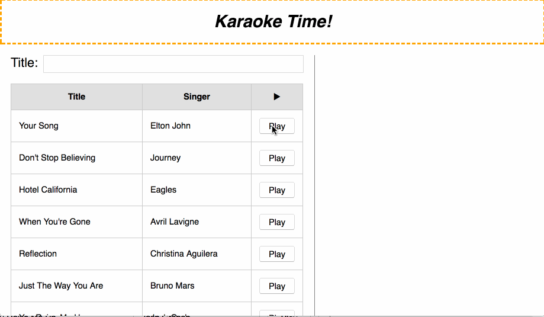
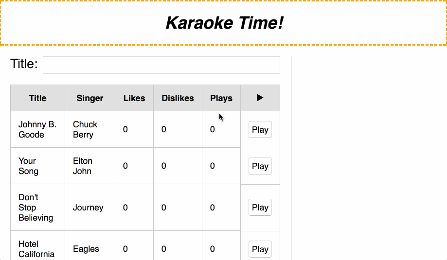
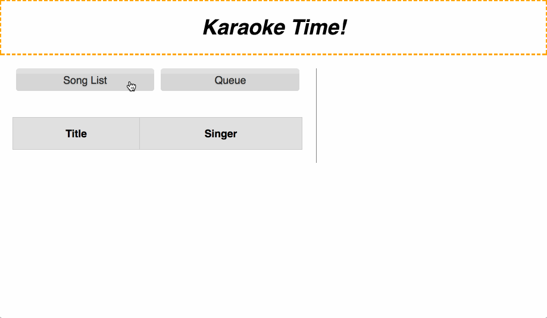

README
======

## React Mock Code Challenge

### Instructions

It's Karaoke Night at Flatiron School, but oh no! The karaoke machine is broken!!

Luckily, through the power of React and the [flux](https://github.com/facebook/flux) capacitor, your fellow cohort members were able to travel back in time to give you the code to a replacement karaoke app! Unluckily, time travel had adverse effects on the codebase and much of it was damaged. The component hierarchy survived as did the karaoke playback engine in `Lyrics.js`.

Your future cohort members had to return for fear of running into their present selves. However, before leaving, they left you with a few things to help you on your way:

- Example data for the future API you will use. This is in `data/songs.js`.
- This helpful `README.md` with all the deliverables that need to be completed.

It's now up to you to fix the rest of the codebase before the start of Karaoke Night!

---

### Setup

#### Frontend

- Clone this project and `cd` into it.
- Run `npm install` to install your dependencies.
- Run `npm start` and the project will be running on `localhost:3000`.

#### Backend

- Clone this repository in a different directory: `https://github.com/hysan/react-karaoke-challenge-backend`
- `cd` into it.
- Run `bundle install` to install your dependencies.
- Run `rails db:create rails db:migrate rails db:seed` to create and seed your database.
- Run `rails s -p 4000` and the API will be running on `localhost:4000`.

**Routes**

- URL for database: `http://localhost:4000`
- You will be given a `:user_id`

**Please use your own ID or else you will be editing someone else's data!**

| route                                    | method  | returns                              |
| ---------------------------------------- |:-------:| ------------------------------------:|
| `/users/:user_id/songs`                  | `GET`   | array of songs                       |
| `/users/:user_id/songs/:song_id`         | `GET`   | song object                          |
| `/users/:user_id/songs/:song_id/play`    | `PATCH` | updated song object (`plays` + 1)    |
| `/users/:user_id/songs/:song_id/like`    | `PATCH` | updated song object (`likes` + 1)    |
| `/users/:user_id/songs/:song_id/dislike` | `PATCH` | updated song object (`dislikes` + 1) |

**Notes**

- None of the `PATCH` calls require a `body`.

---

### Suggested Workflow

- Consider each set of deliverables as a milestone. Don't proceed until you've finished the previous set of deliverables:
  - **Deliverables**
  - **BONUS**
  - **SUPER BONUS**
  - **SUPER DUPER BONUS**
- Use the fake data in `data/songs.js` first to make sure some of your components work.
- Then replace the data with the fetched data so you have a way to confirm it.
- After that, you can tackle the rest of the deliverables.
- Before each bonus, commit your work and branch!

---

### Deliverables

This is your end goal:

- [ ] Display a list of songs with their artist in the left sidebar.
- [ ] The list of songs will come from `http://localhost:4000`.
- [ ] Clicking the `Play` button, located next to each song, will load the song in the right panel.
- [ ] The right panel will display the song's title and lyrics.
- [ ] The song's lyrics should be passed into the `Lyrics` component. You should not be editing this file.
- [ ] When typing into the input, the list of songs should filter by song name.

---

**BONUS**

Being the React master that you are, you noticed some extra data and capabilities in the API: `plays`, `likes`, and `dislikes`. So you decided to add some flair to the karaoke machine ;)

- _Tracking Plays_
  - [ ] The song list should display a new column with the number of times a song was played.
  - [ ] This data, number of plays, will come from the API. Every time a song is played (clicking `Play`), a `PATCH` should be sent to the database to increment this value for that song.
  - [ ] If that song is already playing, you should not `PATCH`.
- _Likes & Dislikes_
  - [ ] The song list should display two new columns showing the likes/dislikes of a song.
  - [ ] Refactor and add buttons for liking and disliking the currently playing song above the playing song. A pre-styled component has been provided for you to use: `VoteBar`
  - [ ] The `VoteBar` should be conditionally rendered. It should not appear when a song is not playing.
  - [ ] Clicking like/dislike should send a `PATCH` to the database to increment this value for that song.

Your end result should look like this:

---

**SUPER BONUS!**

You are a React GOD and thought the previous bonus was easy. You decide to add queuing functionality like a real karaoke booth. To do this, you will be refactoring your code to do the following:

_(Be sure to branch before tackling this!)_

- _Add Queuing_
  - [ ] Clicking the `Play` button will no longer play the song right away. Instead, it should:
    - [ ] Add the song to a queue if a song is already playing.
    - [ ] You should not allow a song to be added to the queue if:
      - It's currently playing.
      - It's already in the queue.
    - [ ] Play the song if no song is playing.
  - [ ] The `Lyrics` component has an `onFinish` prop that takes a function. This function will be called when the currently playing song is finished. Use it to play the next song in the queue if any exists.
  - **HINT!** There's a `speed` prop available on the `Lyrics` component that will let you control the speed at which the song plays. It takes in milliseconds.
- _Display the Queue_
  - [ ] Refactor and add the `NavBar` component above the title filter.
  - [ ] Clicking on _Song List_ should show all of the songs.
  - [ ] Clicking on _Queue_ should show the list of queued songs sorted by which will be playing next.

Your end result should look like this (`Lyrics` is sped up for this example):

---

**SUPER DUPER BONUS!**

Gods are perfect and you notice that your code isn't as clean as it can be. Let's make things perfect by _refactoring_:

- [ ] The queue should not show the `Likes`, `Dislikes`, `Plays`, and `▶` columns.
- [ ] Is all of your `state` living in a single place? If so, ask yourself, "Have I lifted too far?" (_hint: you probably have_)
  - [ ] If you haven't already, refactor `KaraokeContainer` so it has `KaraokeDisplay` and a new container component called `Sidebar`.
  - [ ] `Sidebar` should contain everything in the left column and should contain only the `state` it needs. Meanwhile, `KaraokeContainer` should contain only the `state` it needs.

Your end result should look like this:

---

### Criteria

We’ll be evaluating your code based on the following criteria:

- **React Components:** Does the app reasonably separate responsibilities into components and a have a component hierarchy?
- **Props:** Does the app have at least one presentational component that receives props? Does the app pass props down from a higher-level component to a lower one? Does the app make use of passing a functional prop?
- **State:** Does the app have a filter input that responds to changes and calls `this.setState`?
- **Lifecycle Methods & API:** Does the app make a fetch request to the API and return data? Does it set the state of the component within the app with that data within a lifecycle method?
- **Feature:** Does the app filter the list of songs?
- Does the app follow best practices regarding state and component composition?

Good luck!
